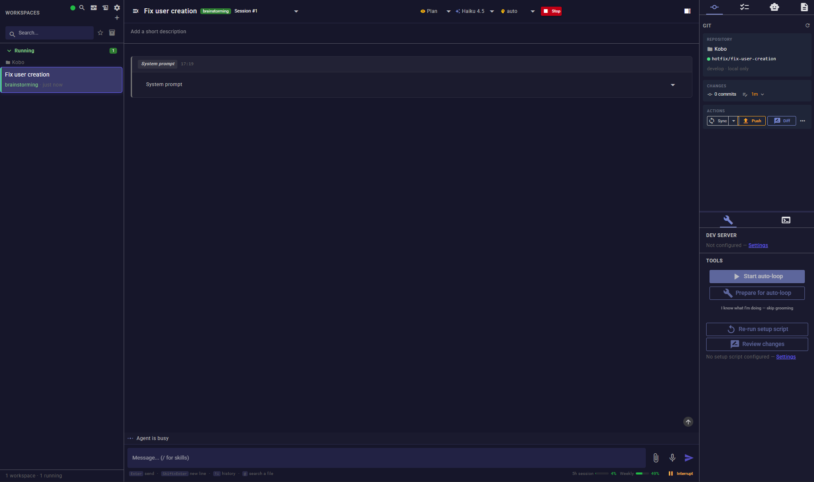
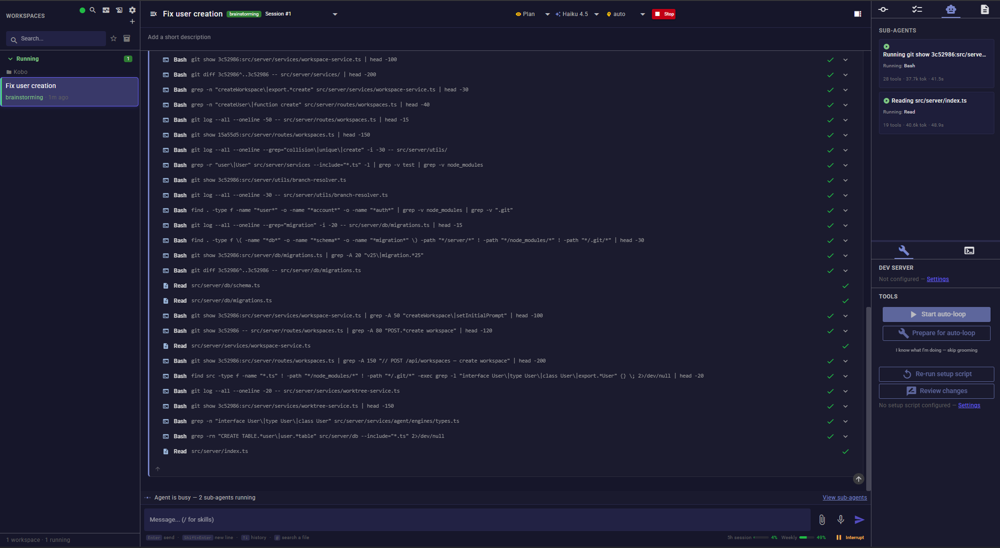
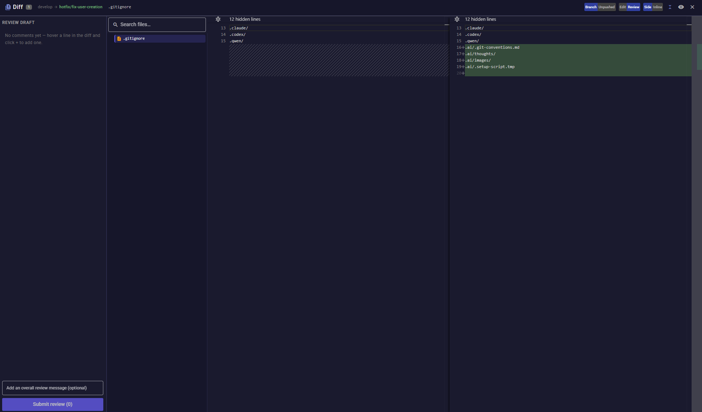
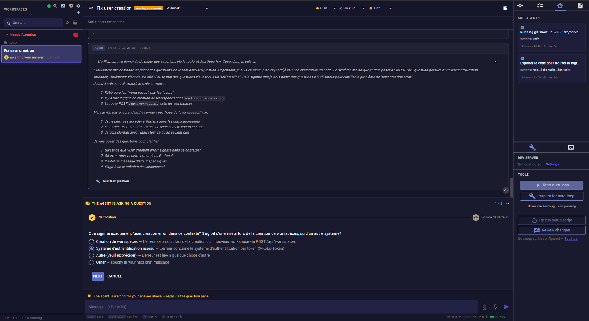

# Kōbō

> Multi-workspace orchestrator for [Claude Code](https://claude.com/claude-code) and [OpenAI Codex](https://developers.openai.com/codex/) agents.

[](https://www.npmjs.com/package/@loicngr/kobo)
[](./LICENSE)
[](https://nodejs.org/)

Kōbō runs multiple coding agents in parallel, each isolated in its own git worktree, branch, and dev server. A single Vue dashboard streams output, tasks, git state, and quota usage across every workspace.



> [!NOTE]
> Active development on `develop`. Forward-only migrations and timestamped pre-migration backups keep upgrades safe.

## Features

- **Isolated worktrees**: each workspace is a dedicated git worktree on its own branch, so parallel sessions never collide.
- **Two agent engines**: Claude Code (via `@anthropic-ai/claude-agent-sdk`) and OpenAI Codex (via `codex app-server`), chosen per workspace.
- **Live chat**: streaming text, reasoning blocks, inline Edit/Write diffs, per-turn cards, a compaction-in-progress indicator, infinite scrollback. `/` autocompletes skills and commands, `@` fuzzy-autocompletes worktree file paths, and you can export any workspace's session events to CSV.
- **Full MCP toolset (`kobo-tasks`)**: a per-workspace MCP server the agent uses for far more than tasks — task/acceptance-criteria CRUD, starting/stopping the dev server and reading its logs, a unified `get_ticket` (Notion or Sentry), searching past conversations across every workspace, per-session token/cost usage, and a `.ai/thoughts` decision log. Native Claude Code Task tools complement it for lightweight sub-agent coordination. See [`AGENTS.md`](./AGENTS.md) for the full tool list.

  
- **Git panel**: a Monaco-based diff viewer with **inline file editing** (edit the right-hand panel directly, save with `Ctrl/Cmd+S`, conflict-guarded via sha precondition), inline conflict resolution, and `Sync` / `Push` / `Open PR` / `Change PR base` / `Change source branch`. Multi-forge: GitHub (`gh`), GitLab (`glab`), or no forge, auto-detected from the remote and overridable per project.

  
- **Dev server panel**: start, stop, and tail logs for a workspace's dev server (Docker or npm) straight from the Tools panel — no need to leave the UI.
- **Attention indicators**: workspace cards surface CI failures, review-requested changes, and a conflict-aware **ready-to-merge** badge, plus a one-click **Fix CI** button that spawns a fix workspace automatically.
- **Interactive Q&A**: an agent can pause mid-session to ask a clarifying question through the UI; the workspace surfaces under "Needs Attention" until you answer.

  
- **Auto-loop**: an opt-in mode that walks the task list, spawning a fresh session per task and stopping once there's nothing left to do, progress stalls, an error occurs, or the agent needs input from you. Optionally run the initial brainstorming session on a stronger model and every task after that on a cheaper one, without leaving the engine you picked.
- **Quota-aware**: 5-hour / 7-day Claude usage and Codex rate-limit buckets sit in the footer, and sessions auto-resume after a rate-limit reset.
- **Scheduled wakeups**: the agent schedules a one-shot wake-up via the `schedule_wakeup` MCP tool. Kōbō persists it across restarts, shows a live countdown, and re-invokes the agent with the stored prompt at the chosen time.
- **Cron schedules**: recurring per-workspace triggers the agent registers through MCP tools (`cron_create` / `cron_delete` / `cron_list`). Each tick resumes the workspace session (skipped if already active), and schedules are re-armed at boot with skip-missed semantics.
- **Lifecycle scripts**: shell scripts run automatically at key moments — **setup** (worktree created), **cleanup** (session ended), **archive** (workspace archived). Configure them globally or per project, with their output streamed into the chat.
- **Disk-space purge**: free a merged workspace's disk space without losing its chat history — see [below](#disk-space-purge).
- **Optional integrations**: Notion (import missions), Sentry (fix from issue URL), local voice transcription (whisper.cpp).

## Quick start

Requires Node.js ≥ 20 and a logged-in Claude Code **or** Codex CLI.

```bash
npx @loicngr/kobo@latest
```

Default port is `3000`. If you already run something on that port (or another Kōbō instance), pick your own. `SERVER_PORT` is read first, `PORT` is the fallback:

```bash
SERVER_PORT=9997 PORT=9998 npx @loicngr/kobo@latest
```

Open <http://localhost:3000> (or whichever port you picked). Data is persisted under `~/.config/kobo/` (override via `KOBO_HOME`).

Want to run from source or contribute? See [`CONTRIBUTING.md`](./CONTRIBUTING.md).

## Configuration

The most common knobs:

| Env var | Default | Purpose |
|---|---|---|
| `PORT` | `3000` | HTTP / WebSocket server port (overridden by `SERVER_PORT` if set) |
| `SERVER_PORT` | none | Preferred override for the server port; takes precedence over `PORT` |
| `KOBO_HOME` | `~/.config/kobo` | Data directory (SQLite, settings, voice models) |
| `NOTION_API_TOKEN` | none | Notion integration token |
| `ANTHROPIC_API_KEY` | none | Claude Code engine credential (alternative to `claude /login`) |
| `OPENAI_API_KEY` | none | Codex engine credential (alternative to `codex login`) |

Global and per-project settings (worktree path, dev server commands, E2E framework, prompt templates, git conventions, branch prefixes, lifecycle scripts, task prompt) are edited in **Settings** at runtime. Per-project values inherit from the global ones when left empty.

The full reference (every env var, every setting key, MCP server registration, Notion / Sentry / Voice setup) is in [`CONFIGURATION.md`](./CONFIGURATION.md).

## Agent runtimes

- **Claude Code.** Authenticate once with `claude /login`. Kōbō calls the embedded SDK directly, so no `claude` binary is required at runtime.
- **OpenAI Codex.** Run `codex login` or export `OPENAI_API_KEY`. Kōbō spawns a long-lived `codex app-server` subprocess per workspace and bridges its JSON-RPC stream to the same UI.

You pick the engine at workspace creation. Both share the same task tracking, permission modes, sub-agent panel, and quota footer. The mapping of Kōbō's four permission modes (`plan` / `bypass` / `strict` / `interactive`) to each engine's native sandbox + approval semantics is in [`CONFIGURATION.md`](./CONFIGURATION.md#permission-modes).

## Disk-space purge

A merged workspace is automatically archived, but its worktree folder usually carries a lot of weight (`node_modules`, `vendor`, build artefacts…). Kōbō frees that space without losing anything queryable:

- **Manual**: workspace context menu → *Free disk space (delete worktree)*. The worktree is removed; the chat history and PR metadata stay in the database.
- **Automatic**: **Settings → Worktrees → Auto-purge worktree on PR merged**. When the pr-watcher sees the OPEN → MERGED transition, it archives **and** purges.
- **Restore**: recreate the folder yourself (`gh pr checkout <pr>` or `git worktree add <path> <branch>`). The pr-watcher detects the directory reappearing within 30 seconds and re-activates the workspace automatically. No UI action needed.
- **Permission errors**: if removal hits `EACCES`/`EPERM` (common with Docker containers writing as `root`), Kōbō first tries to auto-recover by `chown`-ing the worktree from a throwaway Docker container. If that isn't possible, it shows a toast with a copy-pasteable manual recovery command. Full troubleshooting (ACL setup, Docker `USER` directive, manual `chown`) is in [`CONFIGURATION.md`](./CONFIGURATION.md#permission-errors-during-purge).

## Optional integrations

Kōbō ships first-class support for three external systems. All are opt-in and reuse credentials you may already have configured for Claude Code.

- **Notion**: import missions, tasks, and acceptance criteria from a Notion page.
- **Sentry**: paste an issue URL to spawn a fix workspace with the stacktrace, tags, and a TDD workflow.
- **Voice transcription**: local push-to-talk via [`whisper.cpp`](https://github.com/ggml-org/whisper.cpp).

See [`CONFIGURATION.md`](./CONFIGURATION.md) for the setup of each.

## Network access

By default, Kōbō binds to `127.0.0.1` only (localhost). To control Kōbō from
another device on the same Wi-Fi or LAN:

1. Open **Settings → Global → Network access** and enable it.
2. Restart Kōbō when prompted, since the server must re-bind to apply the change.
3. Scan the QR code shown in the Settings panel from your phone, or copy a LAN
   URL and paste the token in the login dialog on the remote device.

> **Trusted networks only.** Kōbō uses plain HTTP, so the token travels in cleartext.
> Do not expose the port to the internet. For remote access over the internet,
> put a terminating HTTPS proxy or a VPN (e.g. Tailscale) in front of Kōbō.
>
> **Production only.** This protection applies when running a built Kōbō
> (`npm start` / `npx @loicngr/kobo`). In development (`npm run dev:all`) the Vite
> dev server is always exposed on the LAN and bypasses the token. See
> [`CONFIGURATION.md`](./CONFIGURATION.md#production-vs-development-mode-important).

See [`CONFIGURATION.md`](./CONFIGURATION.md#network-access) for token management,
QR code details, and all security caveats.

## Skill suites

Kōbō's auto-generated prompts (review, auto-loop grooming, QA, brainstorming) can target four different skill ecosystems, selectable in **Settings → Skills**:

- **[superpowers](https://github.com/obra/superpowers)** (default): a plugin for Claude Code with the brainstorm → spec → plan → execute discipline, TDD, debugging, code review.
- **[gstack](https://github.com/garrytan/gstack)**: CLI slash commands for navigation, QA, design review, ship pipeline, second-opinion via Codex.
- **superpowers + gstack**: both, with each used for what it does best.
- **custom**: write your own prompts.

Optionally pair with **[gbrain](https://github.com/garrytan/gbrain)**, a per-project knowledge graph + semantic search exposed as an MCP server. It is inherited automatically from your `~/.claude.json` config.

Full install instructions and the prompt-suite differences are in [`CONFIGURATION.md`](./CONFIGURATION.md#skill-suites).

## Architecture

Hono backend, Vue 3 + Quasar SPA, SQLite (WAL) for persistence, WebSocket for live updates. Each workspace spawns its own agent engine and a dedicated MCP server (`kobo-tasks`) that the agent uses to query and mutate workspace state.

```
src/
├── server/         # Hono backend (routes, services, db, agent orchestrator)
│   ├── services/agent/engines/  # claude-code/ + codex/ engines
│   └── ...
├── client/         # Vue 3 + Quasar SPA
├── mcp-server/     # kobo-tasks MCP server, spawned per workspace
├── shared/         # types shared backend ↔ frontend
└── __tests__/      # Vitest suite, backend + client, thousands of tests
```

[`AGENTS.md`](./AGENTS.md) covers the data model, WebSocket protocol, engine contracts, MCP tool surface, migration discipline, i18n rules, and contribution guidelines.

## Contributing

PRs welcome. See [`CONTRIBUTING.md`](./CONTRIBUTING.md) for the from-source setup, scripts, and release process, and [`AGENTS.md`](./AGENTS.md) for code conventions and the database-migration discipline.

## License

GPL-3.0-or-later. See [`LICENSE`](./LICENSE).
